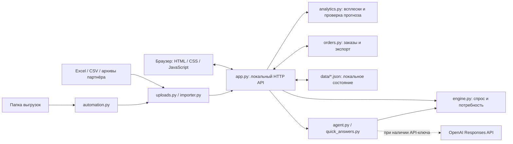

# StockPilot — понятные закупки

**Локальное приложение для расчёта пополнения склада и подготовки заказов поставщикам.** Проект команды **AI GYRLAR** для кейса «Автоматизация формирования заказов поставщикам» компании **Электрокомплект**, HackAlem AI.

StockPilot помогает менеджеру закупок перейти от Excel-выгрузок к обоснованному заказу: отделить разовые крупные продажи от регулярного спроса, учесть остатки и ожидаемые поступления, определить количество к закупке и проверить его перед размещением.

**Для жюри:** проект можно проверить без файлов партнёра и ключа OpenAI. Есть встроенный синтетический пример из шести товаров. После установки зависимостей запустите `python app.py --demo` и откройте [локальное приложение](http://127.0.0.1:8765). Ниже приведены инструкции и [сценарий проверки](#как-проверить-решение) с ожидаемыми результатами.

## Краткое описание

Решение предназначено для менеджеров закупок и специалистов по управлению запасами. При ручной подготовке заказа приходится сопоставлять продажи, складские остатки, товары в пути и условия поставщиков. Разовый проект может завысить оценку регулярного спроса, а неизвестный остаток или поздняя поставка — привести к неверному количеству заказа.

StockPilot объединяет эти данные, показывает основания рекомендации и предупреждает о недостаточной информации. Итог работы — проверяемый расчёт по каждому товару и отдельные заказы поставщикам с выгрузкой в Excel или CSV. Окончательное решение и отправка заказа остаются за менеджером.

## Что реализовано

- **Загрузка данных:** Excel `.xlsx` и CSV, предпросмотр, выбор листа и ручное сопоставление столбцов. Продажи можно передать по операциям или по месяцам; остатки и поставки — отдельными файлами.
- **Расчёт пополнения:** история спроса, сезонность, ограниченный тренд, сценарный прирост, срок поставки, цикл заказа и страховой запас. Учитываются кратность упаковки и минимальная партия — MOQ.
- **Проверка всплесков:** обнаружение необычно крупных продаж, сравнение заказа до и после очистки, решения «Обычный спрос», «Разовый проект» и «Автоматическая оценка».
- **Анализ товаров:** поиск и фильтры, история продаж, исходный и регулярный спрос, остатки, поставки, формула заказа и предупреждения о риске дефицита.
- **Условия закупки:** общие настройки, отдельные сроки и запас по поставщикам, правила категорий, ручная корректировка и проверка количества.
- **Заказы поставщикам:** черновики по поставщикам, изменение количества и ожидаемой даты поступления, история изменений, статусы «Черновик», «Размещён», «Получен», «Отменён», экспорт XLSX/CSV.
- **Учёт обязательств:** черновики резервируют количество от повторного включения; размещённые заказы учитываются в ожидаемых поставках. Полная приёмка увеличивает локальные остатки.
- **Помощник закупщика:** быстрые ответы по расчёту, объяснение товара и сравнение сценариев; при подключённом API — ответы языковой модели с вызовом расчётных функций.
- **Проверка прогноза на истории:** сравнение с простым средним на 1–3 завершённых месяцах, показатели MAE и WAPE отдельно по единицам измерения.
- **Локальное автообновление:** чтение изменившихся выгрузок из папки по расписанию и пересчёт, пока приложение запущено.

## Как работает решение

1. **Входные данные.** Менеджер загружает историю продаж, актуальный свободный остаток и ожидаемые поставки. Товар определяется парой «поставщик + код», без объединения по похожему названию.
2. **Проверка.** Приложение проверяет строки и соответствие источников, показывает пропуски и предупреждения. Менеджер подтверждает, какие обнаруженные всплески относятся к разовым проектам.
3. **Прогноз спроса.** Алгоритм использует завершённые месяцы, очищает подтверждённые или автоматически выбранные всплески, учитывает сезонность и тренд. Компенсация отсутствия товара применяется только при наличии подтверждённых периодов отсутствия.
4. **Расчёт заказа.** Из спроса на срок поставки и цикл заказа, увеличенного на страховой запас, вычитаются свободный остаток и подходящие по дате поступления.
5. **Результат.** Менеджер проверяет карточки товаров, формирует заказы по поставщикам и выгружает их. После фактического размещения и получения отражает эти события в приложении.

Основная формула реализована в `replenishment/engine.py`:

```text
Горизонт = срок поставки + цикл заказа
Потребность = max(0, спрос на горизонт + страховой запас − свободный остаток − поставки в горизонте)

При положительной потребности:
Количество заказа = ceil(max(потребность, MOQ) / кратность) × кратность
При нулевой потребности: количество заказа = 0
```

База прогноза — взвешенное среднее максимум 12 последних месяцев после появления ненулевого спроса. Тренд сравнивает два последовательных трёхмесячных периода и ограничен диапазоном ±30%. Сезонные коэффициенты нормируются к среднему 1; страховой запас задаётся днями покрытия. Для поиска всплесков используются медиана и MAD — медиана абсолютных отклонений.

Просроченная поставка, поставка без даты или за пределами горизонта не уменьшает потребность. Отдельный расчёт остатков по дням выявляет дефицит до поступления: поздняя поставка не устраняет более раннюю нехватку товара. Неизвестный остаток не приравнивается к нулю — количество заказа в таком случае не рассчитывается.

## Технологии

- **Python 3.10+** — сервер, импорт, расчёт, хранение состояния и автоматизация. HTTP-сервер построен на стандартной библиотеке `http.server.ThreadingHTTPServer`, без отдельного веб-фреймворка.
- **HTML, CSS, JavaScript** — браузерный интерфейс в `static/`, без сборщика и установки Node.js.
- **openpyxl `>=3.1,<4`** — чтение Excel и экспорт заказов в XLSX; единственная внешняя Python-зависимость в `requirements.txt`. Синтетический пример и работа с CSV используют стандартную библиотеку.
- **JSON и локальная файловая система** — наборы данных, параметры, решения менеджера и история заказов; отдельная СУБД не используется.
- **OpenAI Responses API** — необязательная интеграция через HTTP-запросы из `urllib.request`, с вызовом функций (*function calling*). Модель по умолчанию в коде — `gpt-5-mini`; имя задаётся переменной `OPENAI_MODEL`.
- **unittest** — автоматические проверки расчёта, импорта, API и пользовательских сценариев.

Количество к заказу вычисляет статистический алгоритм Python. Языковая модель получает факты через функции `inventory_summary`, `find_products`, `explain_product`, `data_quality` и `simulate_scenario`; у неё нет инструмента размещения заказа. Без API-ключа доступны быстрые ответы по расчёту и ограниченный сценарный демо-помощник, а не локальная языковая модель.

## Архитектура проекта

Приложение состоит из браузерного интерфейса и одного локального Python-сервера. Сервер отдаёт статические файлы, принимает запросы `/api/*`, вызывает расчётные модули и сохраняет состояние на диске.



Основные файлы и каталоги:

```text
app.py                     HTTP API, состояние, настройки, планировщик
launcher.py                Поиск работающего сервера, запуск и открытие браузера
START.cmd                  Запуск приложения на Windows
IMPORT_DATA.cmd            Импорт архивов партнёра на Windows
replenishment/
  engine.py                Подготовка истории, прогноз и расчёт потребности
  uploads.py               Проверка и объединение пользовательских Excel/CSV
  importer.py              Импорт специализированных выгрузок IEK и Systeme Electric
  analytics.py             Проверка всплесков и прогноза на истории
  orders.py                Статусы, обязательства, приёмка и экспорт заказов
  automation.py            Обнаружение изменений файлов в папке
  agent.py                 Вызовы OpenAI и сценарный демо-помощник
  quick_answers.py         Детерминированные ответы по текущему расчёту
  demo.py                  Встроенный синтетический набор
static/                    Интерфейс приложения
data/                      Описание данных; локальные JSON создаются при работе
templates/stockouts.csv     Образец подтверждённых интервалов отсутствия товара
tests/                     Автоматические тесты
.env.example               Образец настроек OpenAI
requirements.txt           Зависимость для Excel
package_solution.py        Сборка ZIP с исходниками без данных партнёра и ключей
```

Демо, данные партнёра и пользовательские загрузки имеют отдельные состояния: `data/demo-state.json`, `data/local-state.json` и `data/uploaded-state.json`. Выбранный набор запоминается в `data/active-dataset.json`. Эти файлы, `.env` и импортированный `data/dataset.json` исключены из Git.

## Установка и запуск

### 1. Получить проект

Нужны Python 3.10 или новее и браузер. Git нужен только для клонирования; при наличии распакованного проекта начните со следующего шага в его корневой папке.

```sh
git clone https://github.com/BAITC-Hacks/hack-ed15a85e-ai-gyrlar.git
cd hack-ed15a85e-ai-gyrlar
```

### 2. Создать окружение и установить зависимости

**Windows PowerShell** — активация окружения не требуется:

```powershell
py -3 -m venv .venv
.\.venv\Scripts\python.exe -m pip install -r requirements.txt
```

Если команда `py` недоступна, используйте `python -m venv .venv`.

**Linux / macOS:**

```sh
python3 -m venv .venv
./.venv/bin/python -m pip install -r requirements.txt
```

### 3. Запустить демонстрацию

**Windows PowerShell:**

```powershell
.\.venv\Scripts\python.exe -X utf8 app.py --demo
```

**Linux / macOS:**

```sh
./.venv/bin/python app.py --demo
```

Откройте [http://127.0.0.1:8765](http://127.0.0.1:8765). Для остановки сервера нажмите **Ctrl+C** в терминале. Если порт занят, добавьте `--port 8766` и откройте [http://127.0.0.1:8766](http://127.0.0.1:8766).

Далее `python` в командах означает интерпретатор с установленными зависимостями. При использовании окружения выше заменяйте его на `.\.venv\Scripts\python.exe` в Windows или `./.venv/bin/python` в Linux/macOS.

Обычный запуск:

```sh
python app.py
```

Без сохранённого выбора используется `data/dataset.json`, если он есть; при его отсутствии — синтетический пример. При последующих запусках восстанавливается выбранный набор. Флаг `--demo` выбирает демо, но **не очищает ранее сохранённые демо-заказы и настройки**.

На Windows можно открыть `START.cmd`: он ищет Python в установленной среде Codex, иначе использует `py -3`, запускает сервер в фоне и открывает браузер. Скрипт не устанавливает зависимости и не выбирает `.venv` автоматически; для воспроизводимой проверки используйте команды выше. Лог фонового запуска — `outputs/server.log`; при занятом порте launcher ищет доступный в диапазоне 8765–8784.

### 4. Подключить OpenAI — необязательно

Создайте `.env` рядом с `app.py` по образцу `.env.example`:

```dotenv
OPENAI_API_KEY=ваш_ключ
OPENAI_MODEL=gpt-5-mini
```

Перезапустите сервер. Ключ также можно передать переменной окружения; уже заданные переменные имеют приоритет над `.env`. Для запросов к языковой модели нужны интернет и доступ к выбранной модели в OpenAI API. Установка ключа не требуется для расчётов, импорта, экспорта и демонстрации.

## Как проверить решение

### Сценарий для жюри на встроенном примере

Запустите `python app.py --demo`. Для указанных ниже чисел нужен первый запуск демо без сохранённых изменений: дата расчёта **22.09.2026**, срок поставки **30 дней**, цикл заказа **14 дней**, страховой запас **7 дней**, прирост **0%**, стандартные переключатели включены.

1. **Откройте «Анализ продаж».** В наборе шесть товаров поставщиков IEK и Systeme Electric, помеченных как синтетические. Откройте товар `DEMO-001` — автоматический выключатель 16А. Проверьте историю, остаток, поставку и формулу; исходная рекомендация при стандартных настройках — **60 шт.**
2. **Откройте «Проверка всплесков».** Для `DEMO-001` за июль 2026 года есть разовая крупная продажа. Сравнение показывает заказ **840 → 60 шт.** при очистке этого месяца. Выберите «Обычный спрос», сохраните решение и проверьте изменение рекомендации; затем выберите «Разовый проект» и сохраните снова.
3. **Проверьте помощника.** В карточке товара нажмите «Объяснить с агентом», затем задайте «Сценарий роста 20%». Ответы по расчёту доступны без API-ключа. Сценарий сравнивает результаты и не меняет сохранённые параметры.
4. **Создайте заказ.** В анализе выберите `DEMO-001` и нажмите «Сформировать заказы». В разделе «Заказы поставщикам» появится черновик для IEK. Проверьте количество и дату поступления, выгрузите XLSX или CSV. Повторное создание по той же потребности не должно дублировать зарезервированное количество.
5. **Проверьте статусы на синтетике.** Отметьте размещение заказа: он станет ожидаемой поставкой и уменьшит новую потребность. При подтверждении полного получения подтвердите, что текущий остаток ещё не включает эту поставку. Остаток увеличится, а заказ перейдёт в полученные; повторная приёмка запрещена. Это локальная демонстрация, поставщику ничего не отправляется.
6. **Откройте «Качество прогноза».** Запустите проверку за три месяца: для встроенного набора доступны шесть товаров и 18 пар «товар — месяц». Интерфейс покажет ошибки алгоритма и простого среднего отдельно для штук и метров.

Уже сохранённые решения, заказы или изменённые настройки могут изменить эти числа. Для повторного показа учитывайте текущее состояние демо; `--demo` не является сбросом данных.

### Проверка импорта без подготовки собственных файлов

В разделе «Данные» скачайте три встроенных образца CSV: продажи, свободные остатки и товары в пути. Загрузите их в таком же порядке, проверяя сопоставление столбцов, и нажимайте «Применить и пересчитать». В образцах используются общие коды `A-001` и `A-002`; даты формируются относительно дня скачивания. Выберите соответствующую дату расчёта.

После загрузки только продаж количество заказа не рассчитано из-за неизвестного остатка. После добавления остатков появляется рекомендация, а после поставок она пересчитывается с учётом ожидаемых поступлений. Затем можно сформировать заказ и проверить экспорт. Пользовательская загрузка сохраняется отдельно от демо.

### Автоматические проверки

После установки `requirements.txt` выполните из корня проекта:

```sh
python -m unittest discover -s tests -v
```

При подготовке этого README **134 теста прошли успешно** в среде **Python 3.12.14 / openpyxl 3.1.5**. Проверяются расчёт, всплески, сезонность и сроки, импорт трёх источников, ошибки и сохранение состояния, статусы заказов и приёмка, экспорт, автообновление и историческая проверка прогноза. Тесты обращения к OpenAI используют имитацию API и не подтверждают доступность внешнего сервиса или корректность конкретного ключа.

## Данные и интеграции

### Пользовательские Excel и CSV

В интерфейсе поддерживаются три источника:

- **Продажи по операциям:** код товара, дата продажи, количество. Альтернатива — код и отдельные столбцы месяцев, например `2026-01` или `Январь 2026`.
- **Свободные остатки:** код товара и остаток. Дополнительно — дата снимка, поставщик, единица, кратность и минимальная партия.
- **Товары в пути:** код товара, количество и дата поступления. Номер заказа помогает различать поставки и сопоставлять их с локальными заказами StockPilot.

Первая строка содержит заголовки. Поставщика можно передать столбцом или задать для файла; сопоставление только по коду допустимо, когда оно однозначно. Текстовые коды с ведущими нулями и десятичная запятая поддерживаются. В ручном импорте выбирается один лист; остальные листы не объединяются автоматически.

При обновлении действуют следующие правила:

- История продаж **заменяется**, а не прибавляется к прошлой загрузке. Пропуски месяцев внутри периода файла считаются нулевыми продажами: передавайте полную историю.
- Остатки — **полный снимок**. У отсутствующих в нём товаров остаток становится неизвестным; подтверждённый ноль нужно передать явно. Новый снимок заменяет и ручные изменения остатков, включая локальную приёмку.
- Товары в пути — **полный снимок внешних поставок**. Отсутствие товара означает отсутствие внешних поставок для него. Несколько поступлений одного товара допустимы с разными датами или номерами заказов.
- Отдельно загруженные остатки и поставки сохраняются при обновлении продаж для совпавших товаров, вместе с исходными датами. Обновление продаж не делает старый остаток свежим.
- Неизвестные товары в дополнительных источниках, неоднозначные коды и ошибочные строки блокируют импорт. История, удаляющая товары из действующих заказов, также отклоняется.
- Если внешний снимок уже содержит размещённый заказ StockPilot, передайте его номер `SP-…`, чтобы одна поставка не учитывалась дважды.

Сохраняются сведения об источнике: файл, лист, время загрузки, дата расчёта, число строк, контрольная сумма и предупреждения. Исходные файлы не изменяются.

### Материалы кейса IEK и Systeme Electric

В проекте есть специализированный импортёр двух архивов партнёра — `IEK.zip` и `Systeme electric.zip`. Он ожидает по шесть Excel-файлов на поставщика: динамику продаж, месячные продажи и остатки, сезонность, поставки и MOQ. Формат и отдельные даты импортёра привязаны к материалам кейса на **22.09.2026**; для произвольных новых выгрузок используйте загрузку через интерфейс.

**Архивы и готовый `data/dataset.json` не входят в Git-репозиторий.** Если материалы предоставлены отдельно, импортируйте их:

```sh
python -X utf8 -m replenishment.importer --archives "C:/Data/IEK.zip" "C:/Data/Systeme electric.zip"
```

Замените пути на свои. Для распакованных каталогов `IEK` и `Systeme electric` внутри общей папки:

```sh
python -X utf8 -m replenishment.importer --source "C:/Data" --output data/dataset.json
```

На Windows альтернативный запуск — `IMPORT_DATA.cmd "C:\Data"`; без аргумента он ищет архивы в папке «Загрузки». После импорта перезапустите приложение; если ранее был выбран другой набор, нажмите на главной «Данные кейса».

Подтверждённые интервалы отсутствия товара можно добавить по образцу `templates/stockouts.csv`:

```sh
python -X utf8 -m replenishment.importer --source "C:/Data" --stockouts "C:/Data/stockouts.csv"
```

Поля — `supplier,code,start,end`, даты в формате `YYYY-MM-DD`, обе границы включены. Дополнительное описание схемы и исходных материалов находится в [data/README.md](data/README.md). Приведённые там сведения о пакете партнёра не означают, что этот пакет включён в текущий клон.

### Обновление из папки

Сначала загрузите свои продажи вручную. Затем в разделе «Данные» → «Обновление по расписанию» задайте существующую папку абсолютным путём и интервал проверки. Поддерживаются имена `sales.xlsx`, `stock.xlsx`, `transit.xlsx` либо соответствующие `.csv`.

Нужен максимум один файл каждого типа: одновременно `sales.xlsx` и `sales.csv` считаются ошибкой. Для автоматического импорта требуются один непустой лист и распознаваемые заголовки из образцов. Изменения определяются по контрольным суммам; ошибка отменяет применение обновления. При пустом пути выполняется только пересчёт текущих данных.

Это обмен файлами. Прямого подключения к 1С, ERP, электронной почте или API поставщиков в проекте нет. Автообновление работает только пока запущен Python-сервер.

### Внешний AI-сервис

Необязательная сетевая интеграция — `https://api.openai.com/v1/responses`. При её использовании в OpenAI отправляются вопрос, ограниченная история диалога и результаты вызванных функций, которые могут содержать сведения о товарах, остатках и продажах. В запросе установлено `store=False`. Основные данные и заказы сохраняются локально; расчёт и файловый обмен не требуют OpenAI.

## Ограничения

- **Локальный однопользовательский MVP.** Сервер слушает только `127.0.0.1`; авторизации, ролей и совместной работы нет. Текущий HTTP-сервер и модель хранения не подготовлены для публичного многопользовательского размещения.
- **Качество зависит от исходных данных.** Неизвестный остаток блокирует расчёт количества. Остаток старше трёх дней относительно даты расчёта, без даты или из будущего делает рекомендацию предварительной. Без кратности временно используется 1; перед размещением требуются подтверждённые данные.
- **Обнаруженный всплеск — кандидат на разовую продажу.** Эвристика не подтверждает бизнес-причину. Нулевые продажи не доказывают отсутствие товара; корректировка спроса требует подтверждённых периодов. В партнёрском импортёре нет ID клиента для проверки клиентских аномалий.
- **Демонстрация не доказывает бизнес-эффект.** Экономия и снижение дефицита в реальной работе не измерены. MAE и WAPE оценивают исторические продажи, которые могут отличаться от реального спроса.
- **Историческая проверка ограничена.** Нужны минимум шесть последовательных месяцев перед проверяемым месяцем. В ней отключены заранее подготовленные коэффициенты сезонности, корректировки отсутствия товара и ручные решения, чтобы не использовать сведения из будущего; это не полная проверка всех настроек рабочего расчёта.
- **Заказы не отправляются автоматически.** Статус «Размещён» фиксирует действие менеджера. Поддерживается только полная приёмка, без частичных поступлений. Автоматического пересчёта между закупочными и складскими единицами нет.
- **Ограничения ручной загрузки:** `.xlsx`/`.csv`, до 20 МБ, 250 000 строк, 10 000 товаров, 240 столбцов и 10 листов; за один импорт выбирается один лист. Формат `.xls` не поддерживается.
- **Фиксированные предположения требуют проверки.** Начальные 30/14/7 дней — редактируемые параметры, а не подтверждённые договорные условия. У обычных пользовательских загрузок сезонность нейтральная.
- **Без API-ключа нет свободного диалога с LLM.** Доступны расчётные ответы и сценарный помощник; работа подключённой модели зависит от внешнего API.

## Развёрнутая версия

**Ссылка на публичную deployed-версию в текущем репозитории не указана.** Подтверждённый способ демонстрации — локальный запуск и открытие [StockPilot на 127.0.0.1:8765](http://127.0.0.1:8765). Это адрес приложения на компьютере проверяющего, а не публичный сайт.
